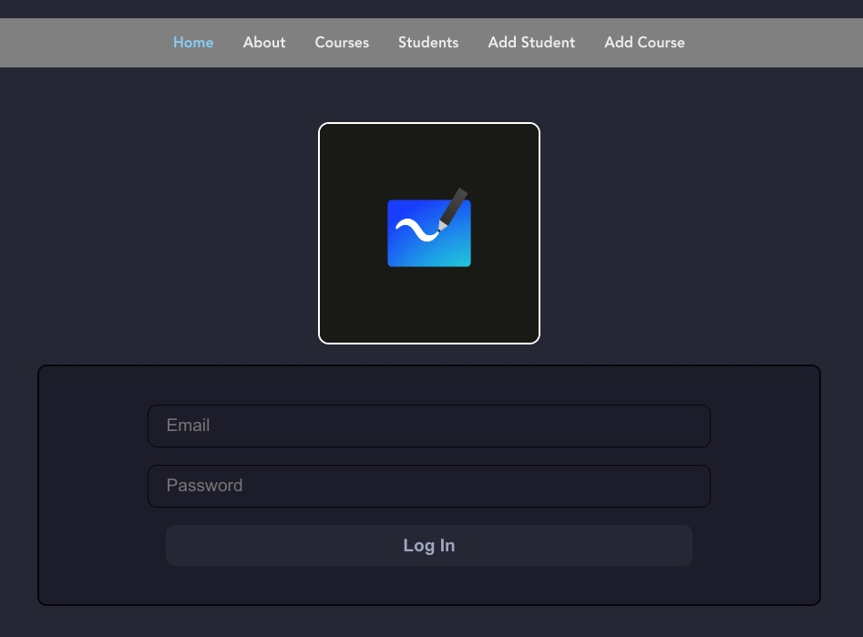

# **Whiteboard**

## **_Table of Contents:_**

1. Collaborators
2. Motivation
3. Project Description
4. Technologies Used
5. Future Updates
6. Credits

## **_Collaborators_**

|      Name      |                                                                   GitHub                                                                   |                                                                       LinkedIn                                                                       |
| :------------: | :----------------------------------------------------------------------------------------------------------------------------------------: | :--------------------------------------------------------------------------------------------------------------------------------------------------: |
| Rafael Montes  |  |  |
| Joshua Jumelet |          |            |
| Jonshea Nutson |          |                 |

---

### **_Motivation_**

Our motivation for this collaborative project was to refine our programming acumen; build and develop out knowledge around Vue.js as well as further develop our understanding of Postgres Sequelize databases and their interactions with a front end server. We accomplished this together after only nine weeks of instruction enrolled in General Assembly's Software Engineering Immersive program.

### **_Description:_**

This PEVN stack application that provides a simple educator platform for users. The user can create a student profile, select a courses, create a new student and course, and view grades and enrollment.

---

### **_Technologies Used_**

- HTML
- CSS
- JavaScript
- Vue.js
- Express.js
- Node.js
- PostgreSQL

---

### **_Future Updates_**

1. User Auth

### **_Credits:_**

- MDN Web Docs
- W3 Schools
- Geeks for Geeks
- draw.io
